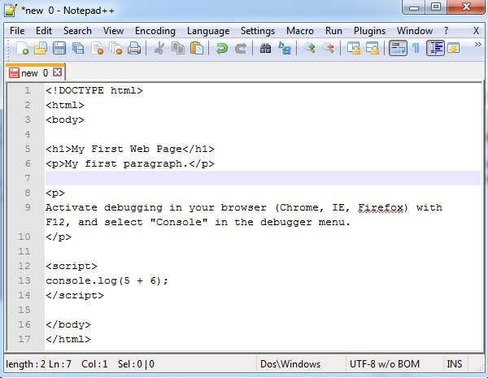
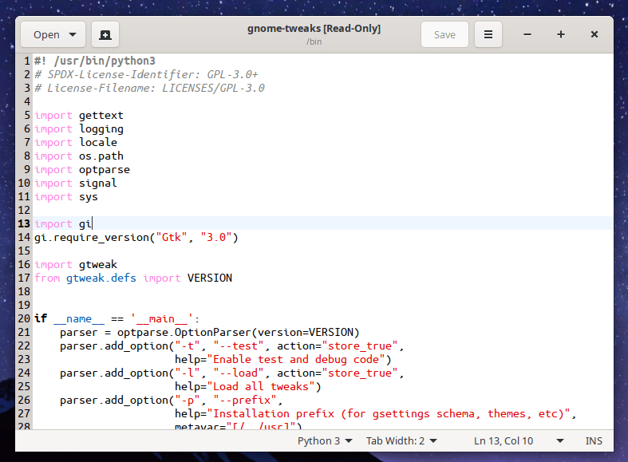
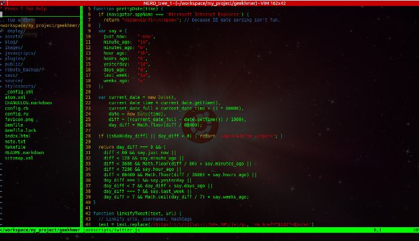
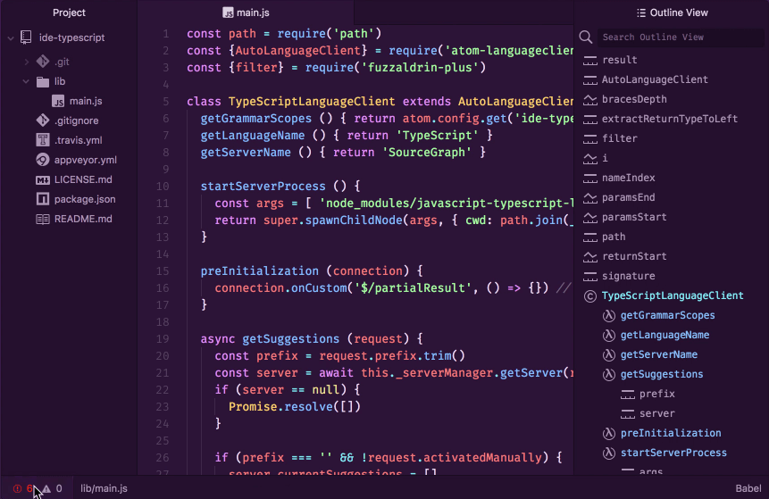

## El editor de texto

Es un programa más o menos sencillo, que permite escribir y guardar documentos de texto. Este texto, a diferencia de los programas de *procesamiento de texto*, no tiene herramientas de cambio de tipo de letra, ni negritas ni centrados, ni encabezados de tamaño grande, columnas o imágenes insertadas.

**Solamente escriben letras, en código** ***Ascii*** **(en la actualidad, *utf*), una detrás de otra.**

La razón detrás de esta (aparente) simplicidad, es que los lenguajes de programación toman estos documentos como base para generar los programas en lenguaje máquina.

Nuestros documentos de texto, escritos en el *idioma* de un *lenguaje de programación*, reciben el nombre de **código fuente** (*source code*).

El **bloc de notas** de Windows (*Notepad*), es un ejemplo de este tipo de programas, aunque es muy elemental.

En Linux tenemos **gedit**, y en este ejemplo vemos ya algo importante. Este programa puede reconocer el lenguaje de programación que estamos escribiendo, y resalta con distintos colores algunas palabras, para que nosotros reconozcamos en esos colores qué tipo de elemento estamos escribiendo, y así poder ver con mayor claridad si cometemos un error de escritura.

Uno de los editores de texto más antiguos, que aún se emplea en la actualidad, es **vim**, en entornos Unix y Linux. Su forma de manejarlo incluye numerosos atajos de teclado, para acceder a todas sus capacidades.

Este programa permite ampliar su funcionalidad mucho, incluyendo ayuda a revisión de errores, y haciendo que se ejecuten desde él distintos comandos de *compilación* o *ejecución*. Es decir, que sin salir del programa del texto, podemos comprobar el funcionamiento de nuestro programa.

## Entornos Integrados de Desarrollo.

Precisamente esta característica anterior se tomó como modelo para una nueva generación de programas para realizar todo el trabajo de desarrollar un programa.

Al principio, un entorno de desarrollo podría manejar un solo lenguaje de programación. Algunos todavía están indicados para un solo lenguaje. Pero otros pueden utilizarse para escribir en diversos lenguajes, gracias al uso de plugins.

Uno de los IDE más usados en la actualidad es **Visual Studio Code** (de *Microsoft*).

En nuestras clases usaremos principalmente **Atom**, que también admite, como el anterior, múltiples lenguajes, y se puede expandir con una gran cantidad de plugins.

Parecidos a los anteriores, pero que solamente se pueden usar con un lenguaje específico son **IntelliJ** (para **Java**) o **CLion** (para **C** y **C++**), de la compañía *JetBrains*.

Los IDE actuales suelen interactuar con los *repositorios* de software online, lo cual facilita realizar el trabajo colaborativamente, y poder usar distintas máquinas según donde estemos. Tanto **VS Code** como **Atom** se pueden conectar con **GitHub**, para guardar nuestro trabajo en la nube.
